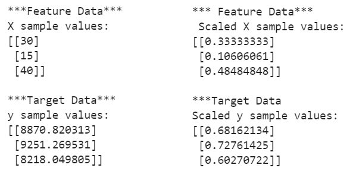
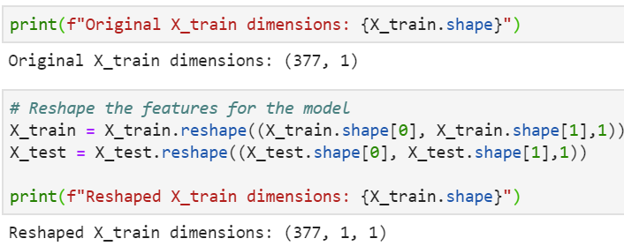

 # Build and Evaluate Deep Learning Models
 ## Overview
 In this project we will develop and evaluate two custom `Long Short-Term Memory Recurrent Neural Network` models that predict Bitcoin `nth` day closing price based on a rolling `X` day window. The first model will use the [Crypto Fear and Greed Index (FNG)](https://alternative.me/crypto/fear-and-greed-index/), which analyzes emotions and sentiments from different sources to produce a daily FNG value for cryptocurrencies. The second model will use Bitcoin closing prices. During training we will experiment with different values for the following parameters: `window size(lookback window), number of input layers, number of epochs, and batch size`. Each model will be evaluated on test data(unseen data). This process can be repeated multiple times until we find a model with the best performace. Then use the model to make predictions and compare them to actual values.

 Note: Each model will be built in separate notebooks. In order to make accurate comparisons between the two models, we need to maintain the same architecture and parameters during training and testing of each model. 

 ## Preprocessing the data for training and testing
 After importing and munging the data, each model will use 70% for training and 30% for testing. 
 
 In order to deal with possible outlier values and avoid skewed models, we need to apply the `MinMaxScaler` function `from sklearn.preprocessing` tools  to scale both x and y. This will arrange the feature and target values between 0 and 1, which will lead to more accurate predictions. 

 Note: It is good practice to fit the preprocessing function with the training dataset only. This will prevent [look-ahead bias](https://corporatefinanceinstitute.com/resources/knowledge/finance/look-ahead-bias/#:~:text=Look%2Dahead%20bias%20is%20a,from%20a%20study%20or%20simulation.).

 

 The [LSTM model](https://machinelearningmastery.com/reshape-input-data-long-short-term-memory-networks-keras/#:~:text=Example%20of%20LSTM%20With%20Single%20Input%20Sample,-Consider%20the%20case&text=The%20reshape()%20function%20when,the%20data%20in%20the%20array.&text=Once%20reshaped%2C%20we%20can%20print%20the%20new%20shape%20of%20the%20array.) requires the input to every layer to be in a 3D matrix format. These three dimensions are (samples, time steps, features). We can convert the data by using the `numpy.reshape` function. 

 

 ## Build and train the LSTM RNN
 To begin designing a custom LSTM RNN we need to import the following modules: 
 ```python 
 from tensorflow.keras.models import Sequential 
 from tensorflow.keras.layers import Dense, LSTM, Dropout
 ```
 The `Sequential` model allows us to add and/or decrease stacks of LSTM layers. Each layer is able to identify and extract different patterns of time series sequences. The `Dropout` layer is a regularization method that reduces overfitting and improves performance by randomly dropping a fraction of the nodes created by the LSTM layer. The `Dense` layer "specifies the dimensionality of the output space". In this project the last layer flattens out the results from all the layers above and gives a single prediction. 

 After designing the model, we are ready to compile and fit it with our training dataset. It is here where we can further optimize our model by experimenting with the `fit` function parameters. We can refer to the official [Keras guide](https://keras.io/guides/) for an in-depth explanation of the LSTM RNN. 
 
 The snapshot below summarizes the architecture that resulted in the best performance for both the FNG and closing price models. 
 ```python
 window_size = 1 
 number_units = 30 # LSTM cells that learn to remember which historical patterns are important. 
 drop_out_franction = 0.2 # 20% of neurons will be randomly dropped during each epoch
 model = Sequential()
# add 1st layer
model.add(LSTM(units = number_units, 
               return_sequences = True,  
               input_shape = (X_train.shape[1],1)
          ))
model.add(Dropout(drop_out_franction))
# add 2nd layer
model.add(LSTM(units = number_units, return_sequences=True))
model.add(Dropout(drop_out_franction))
# add 3rd layer 
model.add(LSTM(units = number_units))
model.add(Dropout(drop_out_franction))
# add output layer
model.add(Dense(units=1))
# Compile the model
model.compile(loss='mean_squared_error', optimizer='adam', metrics=['mse'])
model.fit(X_train,y_train, epochs =50, batch_size=10, verbose = 0, shuffle=False)
 ```

### Evaluating the performance of each model
 After experimenting with different window sizes, and trying different parameter values to train both models, I made the following conclusions:
* A window size of one led to better results for both models
* Training the models with higher values for both epochs and batch sizes resulted in a larger loss during testing. 
* Using the `Fear and Greed Index' as a feauture to train the model resulted in a bigger loss percentage compared to the second model. The lowest loss I achieved was 9.46% for the first model. Using the same parameter values to train the next model resulted in a loss percentage of 0.17%
* The second model, using closing prices, performs better in tracking actual stock prices over time. 


